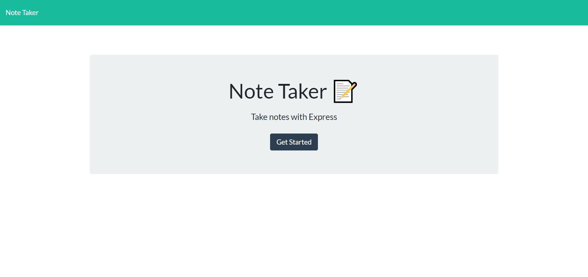
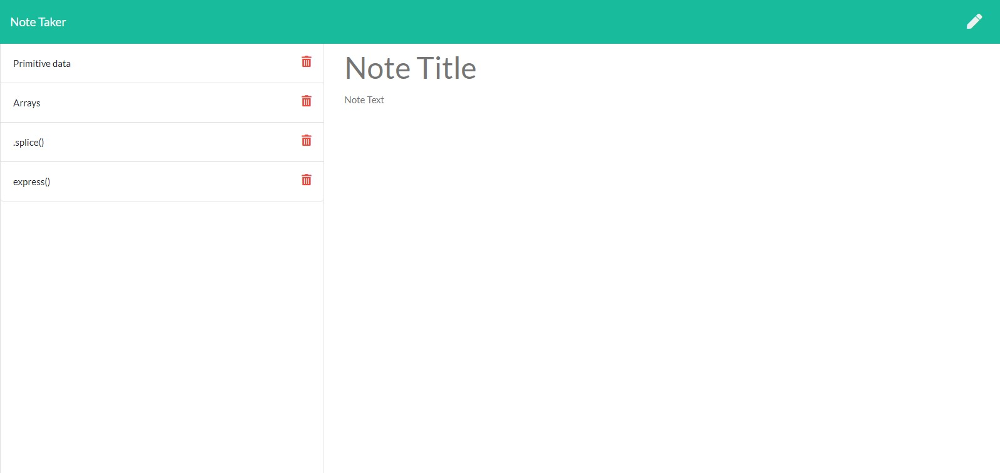

# Note Taker

## Description

An Express.js note taking app. It uses client side requests and posts handled by server-side responses.

## Usage

The app begins on the homepage. After selecting "get started", the note taking can begin! Add an easy to identify title and a lengthier description. When both fields have been entered, the save button will appear. When you save it, the title will populate a tile on the left hand side. To review that note, click directly on the title. Click on the pencil to create a new note.

## Installation

If pulling from github repo, install express and random-id as dependencies and nodemon on dev dependencies. 

## Links

[Heroku](https://hidden-oasis-72157.herokuapp.com/)

[Github Repo](https://github.com/najuasaad/notetaker)

## Screenshots

